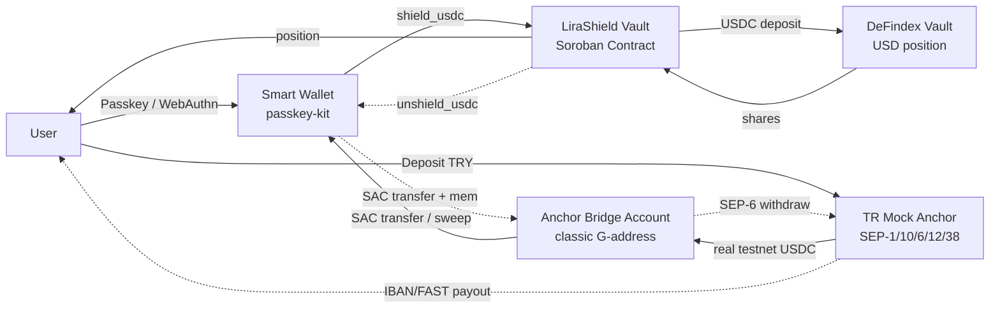

# LiraShield

A non-custodial Stellar vault that turns TRY into a **USD inflation shield**
behind a familiar bank rail: FAST deposit in, IBAN withdraw out — without
showing crypto jargon, and **without inventing an APY** on testnet.

Built for the **Pro Hackathon 2026 (Rise In × Stellar) — Genesis Track**.

### Deploy (Vercel)

- GitHub: [ysfadm/LiraShield](https://github.com/ysfadm/LiraShield)
- In Vercel: **Settings → Build and Deployment → Root Directory** → set to `frontend` (do not put this in `vercel.json`; that property is invalid there)
- Copy `frontend/.env.example` → Vercel Environment Variables (`NEXT_PUBLIC_*`, plus server secrets if used)

## 1. Problem & Value Proposition

For SMEs and freelancers in Turkey, cash held in TRY loses value quickly under
high inflation. Converting to foreign currency or dealing with overseas
brokerage/banking processes is not practical for someone managing day-to-day
cash flow. LiraShield takes a motion the user already knows (deposit/withdraw
via FAST to an IBAN) and automatically, in the background:

1. Converts deposited TRY to USDC (via the anchor rail / Soroswap where needed),
2. Locks USDC in an on-chain vault position (DeFindex holds the shares),
3. When the user wants cash back, runs the same flow in reverse and sends TRY to
   their IBAN.

**What we sell today:** inflation shield (USD exposure) + on/off-ramp.  
**What we do not claim on testnet:** a yield rate or APY. DeFindex is the home
for the protected position and the socket for real mainnet yield later.

The user never sees terms like "swap", "slippage", "gas fee", or "private key" —
only a balance card and two buttons.

## 2. Architecture



Flow summary: **User → Passkey → TR Mock Anchor (SEP-6) → Bridge Account →
Soroban Vault (`shield_usdc`) → DeFindex**, and the reverse on withdrawal.
Because the anchor handles TRY↔USDC conversion on its side, the main path does
not need a Soroswap step; `deposit_and_shield` / `withdraw_to_lira` (functions
that swap via Soroswap) are an alternative path when the user already holds an
on-chain TRY token.

> **Why a bridge account?** SEP-10 login requires a classic Ed25519 signature,
> and the anchor can only send USDC to a classic `G…`/`M…` address — not directly
> to the Passkey smart wallet's `C…` (contract) address. So a lightweight classic
> key stored in the browser (`lib/bridge-account.ts`), never shown to the user,
> talks to the anchor; incoming USDC is swept immediately into the user's real
> wallet (`shield_usdc`).

### Repo structure

```text
lirashield/
├── contracts/
│   └── vault/
│       ├── Cargo.toml
│       └── src/
│           ├── lib.rs        # initialize / deposit_and_shield / shield_usdc / withdraw_to_lira / unshield_usdc / get_user_position
│           ├── storage.rs    # instance (config) + persistent (position) + temporary (tx lock)
│           ├── external.rs   # Soroswap Router & DeFindex Vault client interfaces
│           └── test.rs       # end-to-end tests with mock router/vault
├── frontend/
│   ├── src/
│   │   ├── app/
│   │   │   ├── page.tsx              # Passkey login screen
│   │   │   ├── dashboard/page.tsx    # Balance cards + actions
│   │   │   └── api/
│   │   │       ├── passkey/relay/route.ts       # Fee-sponsored send via relayer
│   │   │       └── mock-anchor/{deposit,withdraw}/route.ts  # FAST simulation
│   │   ├── components/
│   │   │   ├── PasskeyAuth.tsx
│   │   │   ├── ShieldCard.tsx
│   │   │   ├── FastDepositModal.tsx
│   │   │   └── FastWithdrawModal.tsx
│   │   └── lib/
│   │       ├── stellar.ts        # network config, amount scaling helpers
│   │       ├── anchor-sep.ts     # TR Mock Anchor (SEP-1/10/6/12/38) integration (mock/live mode)
│   │       ├── bridge-account.ts # classic bridge key stored in the browser for the anchor
│   │       ├── soroban-client.ts # typed Client for the vault contract + shared signing interface
│   │       └── passkey.ts        # passkey-kit bridge (register/login, signing, relay)
├── Makefile
└── README.md
```

## 3. Stellar Skills References

This project was built with reference to the following official Stellar skill
files:

- `skills/anchors/SKILL.md` — SEP-1/10/6/12/38 TRY fiat rail flow ([TR Mock Anchor](https://tr-mock-anchor.fly.dev/), verified with SDF `anchor-tests`).
- `skills/standards/SKILL.md` — deciding which SEP/CAP to use.
- `skills/protocols/soroswap-sdk` — Soroswap Router integration (`contracts/vault/src/external.rs`).
- `skills/protocols/defindex-sdk` — DeFindex Vault integration (`contracts/vault/src/external.rs`).

## 4. Setup & Run

### Prerequisites

- Rust + Cargo (`rustup target add wasm32v1-none`)
- Stellar CLI (`stellar contract ...`)
- Node.js 20+ / npm

### Contract

```bash
make contract-test     # run unit tests
make contract-build    # produce target/wasm32v1-none/release/lirashield_vault.wasm
make contract-deploy   # deploy to Testnet (set the admin account with SOURCE=<identity>)
```

After deploy, call `initialize` once with the admin, TRY/USDC token addresses,
Soroswap router, and DeFindex vault addresses:

```bash
stellar contract invoke \
  --id <VAULT_CONTRACT_ID> --source lirashield-admin --network testnet \
  -- initialize \
  --admin <ADMIN_G_ADDRESS> \
  --try_token <TRY_SAC_CONTRACT_ID> \
  --usdc_token <USDC_SAC_CONTRACT_ID> \
  --soroswap_router <SOROSWAP_ROUTER_CONTRACT_ID> \
  --defindex_vault <DEFINDEX_VAULT_CONTRACT_ID>
```

### Frontend

```bash
cd frontend
cp .env.example .env.local   # fill in the values
npm install
npm run dev
```

With `NEXT_PUBLIC_ANCHOR_MODE=live` (default), the TRY deposit/withdraw flow
runs against the real [TR Mock Anchor](https://tr-mock-anchor.fly.dev/) over
SEP-1/10/6: the bank and KYC sides are simulated, but SEP-10 login and real
testnet USDC transfers/claimable balances are real (verified with SDF
`anchor-tests`). If the anchor is unreachable (e.g. network issues during a
demo), set `NEXT_PUBLIC_ANCHOR_MODE=mock` to fall back to our own
`/api/mock-anchor/*` endpoints.

In mock mode, `/api/mock-anchor/deposit` only transfers from an explicitly
configured mock USDC issuer account. Set `MOCK_USDC_ISSUER_SECRET`,
`MOCK_USDC_TOKEN_CONTRACT_ID`, and optionally `MOCK_ANCHOR_MAX_TRY_AMOUNT` as
server-only environment variables; do not enable mock mode in production.

## 5. Testnet Deployment Addresses

| Component                           | Contract ID / Address                                      |
| ----------------------------------- | ---------------------------------------------------------- |
| LiraShield Vault                    | `CD5Q274Y3XC2HQA5ZHTGQHQHFRX4O7LURDPRWH4G5MWMFJLZRDJKLF25` |
| TRY Token (SAC, LiraShield issuer)  | `CDLR5NMVHRM2KYYZ5C774EV4U3PYBSYSGSNYCHKREYX2TZP6337CGHGL` |
| USDC Token (BlendUSDC, vault config)| `CAQCFVLOBK5GIULPNZRGATJJMIZL5BSP7X5YJVMGCPTUEPFM4AVSRCJU` |
| Soroswap Router (testnet)           | `CCJUD55AG6W5HAI5LRVNKAE5WDP5XGZBUDS5WNTIVDU7O264UZZE7BRD` |
| DeFindex Vault (PaltaLabs, testnet) | `CBMVK2JK6NTOT2O4HNQAIQFJY232BHKGLIMXDVQVHIIZKDACXDFZDWHN` |

> **Why two different "USDC" tokens?** TR Mock Anchor issues its own USDC
> (issuer `GBBD47IF...`), but DeFindex testnet vaults only support **BlendUSDC**
> (from Blend Capital's testnet pool, the only audited testnet strategy) — they
> are different tokens. So the frontend converts anchor USDC to BlendUSDC via a
> Soroswap pool that already has testnet liquidity, before `shield_usdc` (and
> the reverse after `unshield_usdc`) — see `lib/anchor-sep.ts` and
> `buildRouterSwapTx`/`buildSacApproveTx` in `lib/soroban-client.ts`. The vault
> contract itself always works with a single "USDC" (BlendUSDC); bridging stays
> entirely in the anchor integration layer.

### Test steps

1. `make contract-test` — 7 unit tests (initialize, paths with and without swap, slippage and insufficient-balance guards).
2. Connect an account with Passkey on the `/` page.
3. Use "Deposit and protect" to deposit some TRY — the main demo path receives
   real testnet USDC via TR Mock Anchor, converts from the bridge account via
   Soroswap to DeFindex's BlendUSDC asset, and deposits with `shield_usdc`.
4. Confirm `usdc_shares` increased via `get_user_position`.
5. Use "Withdraw to IBAN" to withdraw some — `unshield_usdc`, then BlendUSDC →
   anchor USDC Soroswap conversion, memo'd treasury transfer, and SEP-6 off-ramp
   complete; confirm the balance dropped.

`deposit_and_shield` and `withdraw_to_lira` are alternative contract paths used
when the user already holds an on-chain TRY asset and working TRY/USDC Soroswap
liquidity. They are not part of the testnet demo flow; the main demo does not
call them because the testnet TRY pool has no liquidity.

## 6. Notes

- Passkey/smart wallet login is the only auth path; binding an external wallet
  (Freighter, etc.) was intentionally removed for the MVP.
- Anchor integration is written against a real SEP-1/10/6/12/38 service (TR Mock
  Anchor); the same code can move to any real mainnet anchor by changing only
  `NEXT_PUBLIC_ANCHOR_HOME_DOMAIN`.
- `NEXT_PUBLIC_ANCHOR_MODE=mock` is a fallback for demo reliability only; the
  primary path is always the real anchor.

## 7. Launch Checklist

- Current WASM is produced with `make contract-build`; if a redeploy is needed,
  use `make contract-deploy SOURCE=lirashield-admin`. The frontend currently
  uses the verified testnet vault address.
- `RELAYER_ALLOWED_CONTRACT_IDS` is filled in the example config with the vault,
  SAC, and Soroswap router addresses; the relayer endpoint enforces rate limits
  and body size limits.
- `TRY_ISSUER_SECRET`, `RELAYER_API_KEY`, and other server-only variables must
  never end up in the frontend bundle.
- The mock anchor no longer fakes a successful transfer when the issuer secret
  is missing; the demo flow deliberately stops in environments without real
  testnet assets.
- The bridge key is kept only in the tab's `sessionStorage`, so an interrupted
  testnet flow can continue after a page refresh and the key is cleared when
  the tab closes. In production the bridge account should be a backend-
  controlled, limited, operation-based service.
- The UI shows the **dollar shield** (USD value of the protected balance). It
  does not claim a DeFindex APY on testnet; real yield is a roadmap item when
  mainnet vault data is wired.

## 8. SCF / InstaAward Roadmap

Person continuing after the hackathon: **Yusuf (founder)** — product, frontend,
Soroban contract maintenance, real TRY anchor integration, and SCF / InstaAward
application. If the team grows, contract security and compliance get separate
owners; application and roadmap ownership stays with Yusuf.

1. **Real TRY rail** — move TR Mock Anchor's bank/KYC sandbox to a licensed
   Turkey anchor (SEP-6 deposit/withdraw); bring the testnet USDC leg closer to
   mainnet with the same code.
2. **Position ownership** — remove the `sessionStorage` bridge `G…` key; bind
   DeFindex shares to the passkey smart wallet or a limited backend operator.
3. **Protected USD balance** — make the dollar balance shown from DeFindex
   `get_asset_amounts_per_shares` + live rate the single source of truth; never
   show a made-up APY; only then add a separate real-yield line if vault data
   supports it.
4. **Contract hardening** — DeFindex `min_amounts` slippage protection, document
   or collapse the dual-USDC (anchor USDC ↔ BlendUSDC) adapter, external
   protocol tests.
5. **SCF / InstaAward filing** — official application with architecture diagram,
   testnet proofs, TRY market thesis, and 90-day milestones.
6. **First real users** — SME / freelancer waitlist, 10 closed beta accounts,
   KYC/compliance framework, and monthly protected balance metric.
